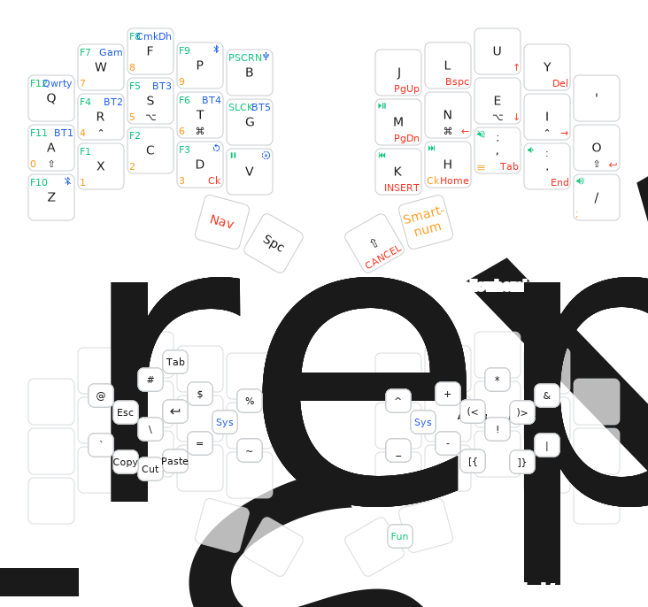

## Instructions

`just release cradio`

## References

- **[urob/zmk-config](https://github.com/urob/zmk-config)**: Working example and reference implementation
- **[urob/zmk-helpers](https://github.com/urob/zmk-helpers)**: Helper macros for simplified ZMK configuration
- **[ caksoylar/keymap-drawer](https://github.com/caksoylar/keymap-drawer)**: drawings

